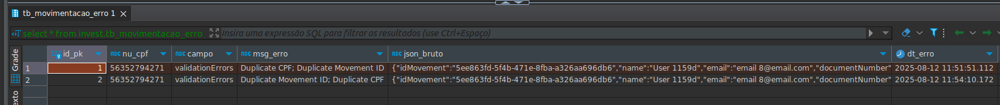

# Documentação para criação de registros de Movimentação, com utilização de WebFlux(SpringBoot), Lambda(Quarkus), banco de dados e Java 21

## Desenho da arquitetura


## Diagrama das tabelas


* Inicialmente rodamos o MS com SpringBoot e WebFlux para criarmos as filas populas com os bodies (Json) ficticios do response esperado pela Lambda 
* Após executar o MS, rodar o script com a porta e o endpoint para o webflux criar os dados e inserir na fila:

```
curl http://localhost:8080/movement/send
```

## Criar configuração para rodar o LocalStack (container para simular serviços da AWS)

* Inicialmente precisamos do docker e docker-compose instalado no computador
* Criar o docker-compose.yml conforme esta no projeto para rodar o localStack localmente
* Criar as filas e tópicos com o container rodando
* Fazer a assinatura da fila com o tópico para a fila poder publicar no tópico

## Rodar a lambda localmente

* No SqsPollingService estamos simulando a leitura da fila com os dados ja inseridos

```
./gradlew clean build
```

# Informações importantes

## Fluxo 

* Inicialmente o MS com WebFlux popula a fila com o JSON
* A Lambda rodando inicia a leitura do conteudo da fila configurada
* Faz as validações
* Salva no banco a entidade Movimentação com endereço


* Atualiza o status para PROCESSADO
* Faz as validações
* Em caso de erro envia o DTO para a fila de retentativa

* A segunda classe lambda tem q ser configurada tanto no properties quando no service de simulação de consumo da fila
* A fila de retentativa passa pelas mesmas validações
* Em caso de sucesso salva a Movimentação no banco
* Em caso de erro salvamos o erro no banco




## Validações 

* Duplicação de CPF
* Duplicação de UUID (MovementId) para uso de checagem da entidade
* Valor negativado
* Date de atualização maior q a de criação


# Ferramentas e Dependências

* Java 21
* SpringBoot (para a popular a fila com o WebFlux) - Maven
* Quarkus (utilização da lambda) - Gradlew
* SNS (tópico) e SQS (fila)
* PostgreSQL
* Lombok